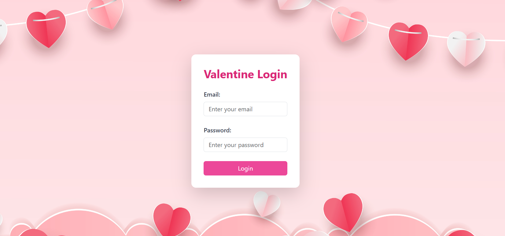
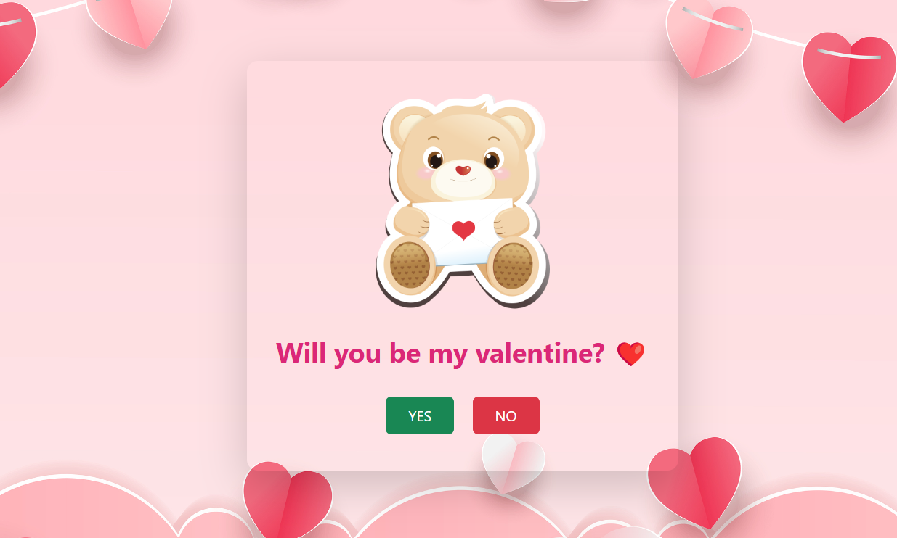
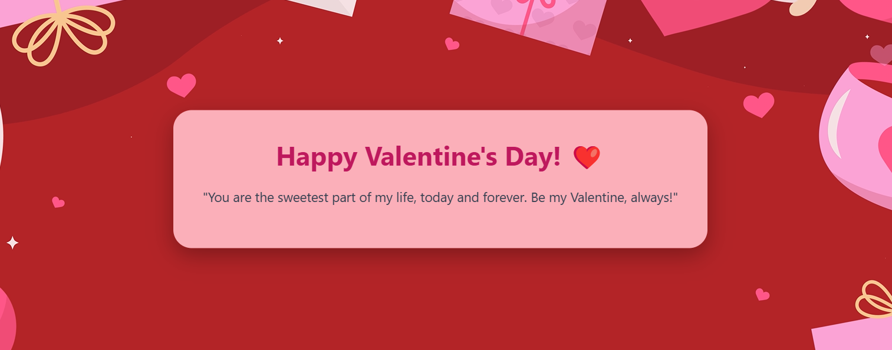

# Valentine Web App ❤️

A simple and beautiful Valentine's Day web app built using HTML, CSS, Tailwind CSS, and Bootstrap.

---

## 🌟 **Project Overview**
This web app is designed to add a little joy to Valentine's Day with interactive pages including:
- A secure **Login Page** with custom credentials.
- A fun and animated **Post-Login Page** asking the most important question, "Will you be my Valentine?" with an adorable teddy bear.
- A heartwarming **Acceptance Page** with a Valentine's Day video background, an animated envelope, and a pop-up card with a sweet message.

---

## 🛠️ **Technologies Used**
- **HTML5**
- **CSS3**
- **Tailwind CSS**
- **Bootstrap 5**
- **JavaScript**

---

## 📁 **Project Structure**
```
valentine-web-app/
│── index.html          # Login page
│── post-login.html     # Post-login page
│── acceptance.html     # Acceptance page
│── style.css           # Custom styles
│── tailwind.css        # Tailwind CSS
│── assets/             # Images and videos
│    ├── Valentine_BG.jpg   # Background image
│    ├── teddy.png          # Teddy bear image
│    ├── envelope.png       # Envelope image
│    ├── valentine-video.mp4 # Valentine's video
│── js/                 # JavaScript files
│    ├── script.js      # Main JS logic
│── README.md           # Project documentation
```

---

## 🔐 **Login Credentials**
- **Email:** valentine14@gmail.com
- **Password:** Valentine@2025

---

## ✨ **Features**
- **Animated Login Page:** Background with Valentine's theme and smooth login experience.
- **Interactive Post-Login Page:** A playful interaction with the "YES" and "NO" buttons that nudges the user towards a positive response.
- **Beautiful Acceptance Page:** Features an animated envelope that reveals a heartfelt Valentine's message.

---

## 🚀 **How to Run the Project**
1. Clone the repository:
   ```bash
   git clone https://github.com/kakkarot164/valentine-web-app.git
   ```
2. Open the project in your preferred code editor (VS Code recommended).
3. Open the `index.html` file in a web browser to start the app.

---

## 📸 **Screenshots**
### Login Page


### Post-Login Page


### Acceptance Page


### Acceptance Page


## 📄 **License**
Personal project 

---

## 🧑‍💻 **Author**
- **Sagar Sarkar**
- [GitHub](https://github.com/kakkarot164)
- [LinkedIn](https://www.linkedin.com/in/thesagarsarkar)

---

Happy Valentine's Day! ❤️

